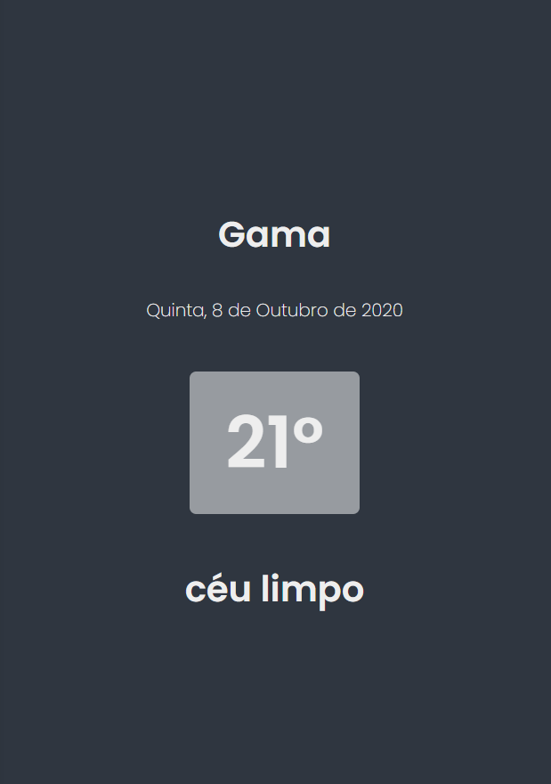

<h1 align="center">
    
</h1>

<h4 align="center"> 
	Movie App
</h4>

<p align="center">
  

  	
  
  <a href="https://github.com/Oppadayo/movie-app/commits/master">
    
  </a>

  
   <a href="https://github.com/Oppadayo/movie-app/stargazers">
    
  </a>
</p>


## 💻 Sobre o projeto

📚 Movie App - é uma aplicação web que mostra uma lista de filmes

Os usuários poderão:
- ver a lista de filmes em alta
- pesquisar por filmes 
- Verificar a nota do IMDB
- Ler a sinopse dos filmes


### Web

<p align="center" style="display: flex; align-items: flex-start; justify-content: center;">
  

  
</p>

## 🛠 Tecnologias

As seguintes ferramentas foram usadas na construção do projeto:

- [HTML]
- [CSS]
- [Javascript]

### Pré-requisitos

Antes de começar, você vai precisar ter instalado em sua máquina as seguintes ferramentas:
- Um navegador
- Editor de texto (caso queira mexer no código)


## 🚀 Como executar o projeto

### 🧭 Rodando a aplicação web (Front End)

```bash
# Clone este repositório
$ git clone https://github.com/Oppadayo/movie-app

# Acesse a pasta do projeto no terminal/cmd
$ cd movie-app

# Execute a aplicação em modo de desenvolvimento
$ start chrome index.html
```

### 📝 ToDos
- [ ] Paginação.
- [ x ] Adicionar menu para acesso além dos filmes.

